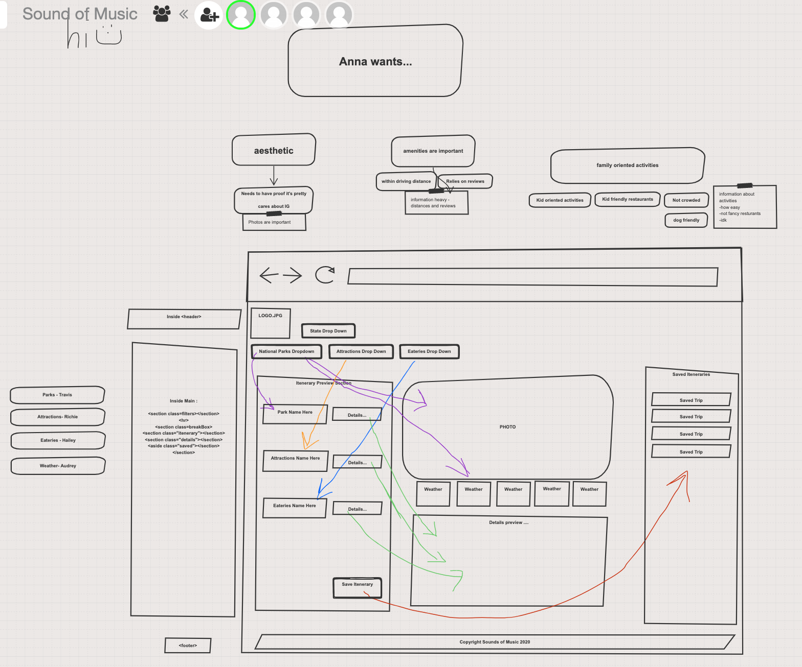
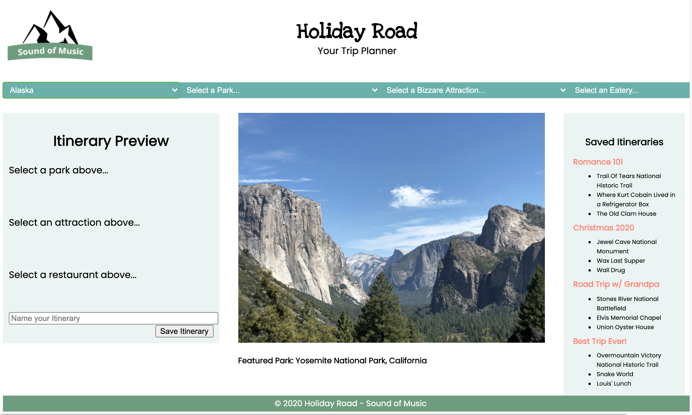
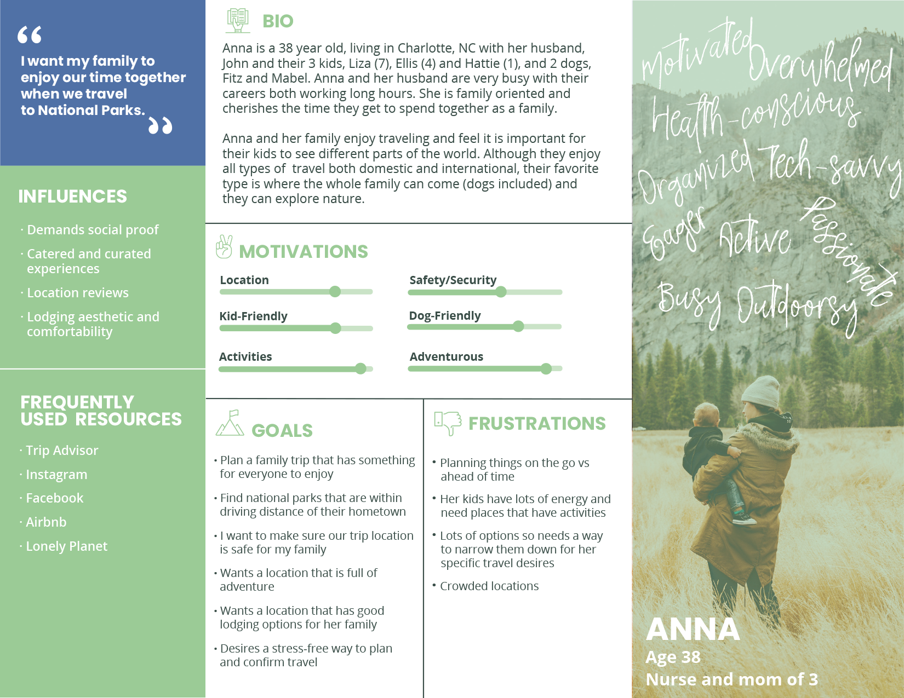

# Holiday Road from Nashville

This project was a group project with myself and 3 teammates. We have been contracted by the National Parks Service to build an application that will allow people to build itineraries for their trips to the beautiful national parks that they maintain. The starting point of each trip will be Nashville, TN, but the destination will a national park selected by the user. When a park is selected, a park photo and the weather for the next five days will automatically be displayed. The user will then be able to add a selected eatery and an attraction. A button will provide additional details about the park, eatery, or attraction. The user can then name and save the itinerary.

We used HTML, CSS, CSS Imports, EventHub, Flexbox, JavaScript native modules, git, and Github to build the website. The entire application was designed to be component based where each component had a single responsibility and communicated informaton via the EventHub. We pulled and filtered information from external APIs to use for the park, attractions, eateries, and weather. Once our user has built an itinerary, we saved the information to a local JSON server.

The most important lessons I learned during this group project involved extending my understanding of EventHub including sending and listening for events on separate modules. I also gained knowledge of finding, filtering, and using information from an external API. This project benefitted from our group's pre-planning of our components, structure, layout, and modules before we started writing code. 

Sketchboard of the planning stage:

Actual webpage:

## Getting Started
After cloning the repository
1. In the `scripts` directory, you will see a file named `.Settings.js` (note the dot at the beginning).
2. Copy that file with `cp .Settings.js Settings.js`. The `Settings.js` file is already in the `.gitignore` file, so it won't ever be tracked by git.
3. Register an API key for the APIs below that need it.
4. Copy your key into the appropriate place in the `Settings.js` file. These will auto-fill into the api calls
as needed.
5. You will need to run the json-server for this project. In your terminal, navigate to the API directory. 
Type the following lines into the terminal: json-server -w entries.json -p 8088

## National Park Service API

* API home: https://www.nps.gov/subjects/digital/nps-data-api.htm
* API documentation: https://www.nps.gov/subjects/developer/api-documentation.htm

## Weather API

https://openweathermap.org/api

## Bizarre Destination

http://holidayroad.nss.team/bizarreries

## Eateries Destination

http://holidayroad.nss.team/eateries

Persona of target client:

Color palette inspiration:

